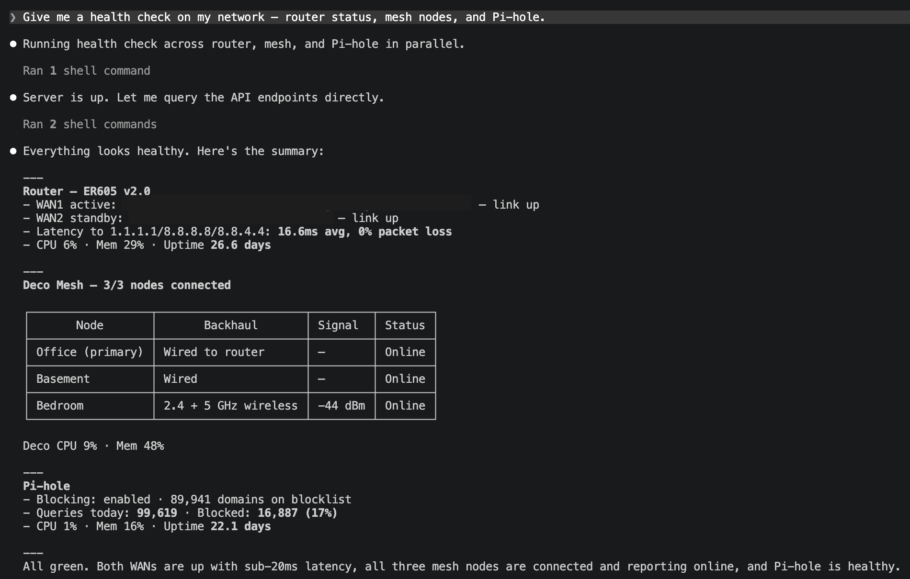
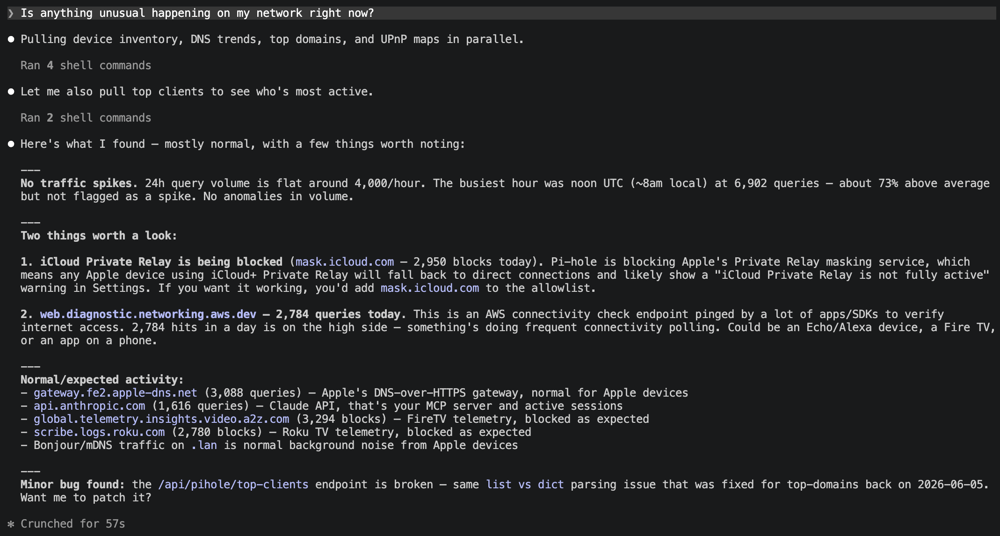
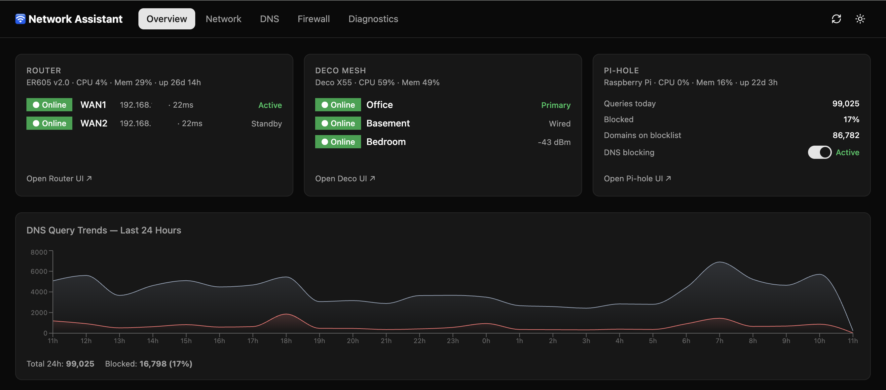
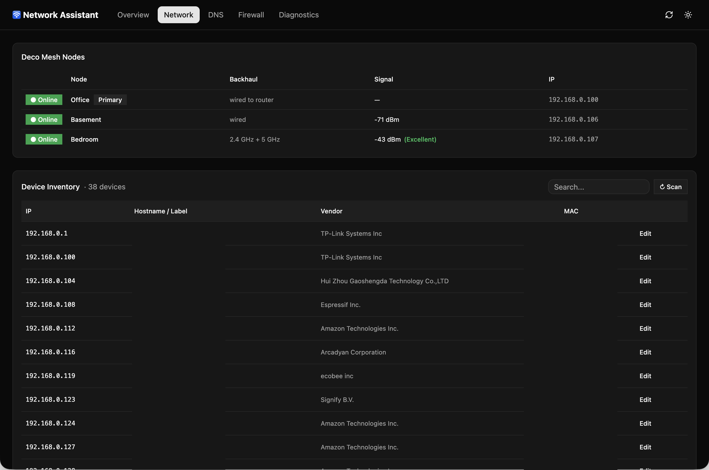
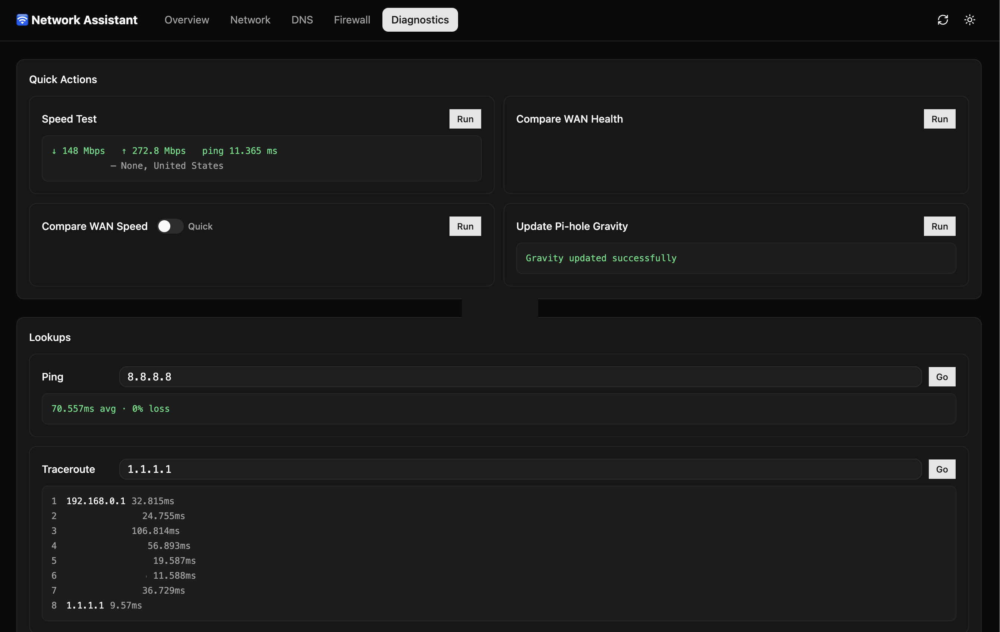
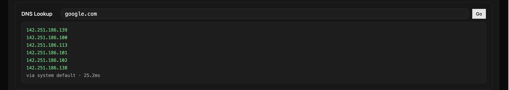

# Network Assistant

A Python MCP server and React dashboard for managing a home network through Claude or a web UI. Connects directly to a TP-Link ER605 dual-WAN router, Deco X55 mesh nodes, and Pi-hole — via reverse-engineered local device APIs — to expose 36 tools covering device inventory, DNS management, WAN health monitoring, port forwarding, firewall rules, and network diagnostics.

> **Why this project exists:** None of these devices have official APIs. Getting all three talking to Python meant reverse-engineering each authentication scheme from scratch — bare RSA (no padding) for the ER605, a 3-step RSA + AES handshake with a session token bound to a specific TCP connection for the Deco, and Pi-hole v6's session-based auth that changed between minor versions. The interesting parts are documented in [API Notes](#api-notes--hard-won-quirks) below.

## MCP Interface

Ask Claude about your network in plain English. It calls the right tools and returns a structured answer.





## Dashboard









## Features

**36 MCP tools across 6 domains:**

| Area | Tools |
|---|---|
| **TP-Link ER605 router** | Router info, WAN status, WAN policy, port forwards, firewall rules, WAN health, WAN speed comparison |
| **TP-Link Deco mesh** | Mesh health, connected clients |
| **Pi-hole** | Stats, query log, top domains/clients, domain lists, clients, system info, blocking control, gravity update, query trends |
| **Network inventory** | Device discovery (ARP + Pi-hole + Deco), MAC vendor lookup, device labeling |
| **UPnP** | Status, active port mappings |
| **Diagnostics** | Ping, traceroute, DNS resolution, speedtest |

**5-tab React dashboard** (Overview · Network · DNS · Firewall · Diagnostics) with auto-refresh, dark/light mode, and a live blocking toggle for Pi-hole.

**169 tests, all mocked** — no live devices needed to run the test suite.

## Requirements

- Python 3.11+
- TP-Link ER605 router (standalone mode, firmware 2.x)
- TP-Link Deco mesh (X55 or similar, local web UI — not the `/ds` API models)
- Pi-hole v6
- Claude Code with MCP support

## Setup

**1. Clone and install dependencies:**

```bash
python -m venv .venv
.venv/bin/pip install -r requirements.txt
```

**2. Configure credentials:**

```bash
cp config.example.json config.json
# Edit config.json with your device IPs and passwords
```

`config.json` is gitignored — it never leaves your machine.

**3. Start the MCP server:**

```bash
.venv/bin/python -m src.server
```

The server runs on `http://localhost:8000/mcp` (streamable-HTTP transport) and serves the dashboard at `http://localhost:8000`.

**4. Connect Claude Code:**

`.claude/mcp_settings.json` is already configured for streamable-HTTP. Start the server before opening a Claude Code session.

The `SessionStart` hook in `.claude/settings.json` will warn you if the server isn't running.

## Configuration

`config.json` structure (see `config.example.json`):

```json
{
  "er605": {
    "host": "192.168.0.1",
    "username": "admin",
    "password": "your-router-password"
  },
  "deco": {
    "host": "192.168.0.1",
    "password": "your-deco-app-password"
  },
  "pihole": {
    "host": "192.168.0.x",
    "api_token": "your-pihole-api-token"
  }
}
```

Device labels are stored in `devices.json` (also gitignored). It's created automatically when you label a device.

## Running Tests

```bash
.venv/bin/pytest -v
```

169 tests, all mocked — no live devices needed.

---

## API Notes — Hard-won Quirks

These took significant reverse engineering to figure out. Documented here for anyone building similar tools.

### TP-Link ER605 (firmware 2.x, standalone)

- **Password encryption is bare RSA (no padding):** right-pad plaintext (`password + "_" + uptime`) with zeros to 128 bytes, then `pow(m, 65537, n)`. NOT PKCS#1. The router accepts uptime ±1 second.
- **Uptime for auth comes from Step 0** (`/locale?form=lang`), not the Step 1 login response. Firmware 2.3.2 omits it from Step 1.
- **`error_code` is a string `"0"`**, not an integer — check `== "0"`.
- **CPU usage** is `{"core1": N, "core2": N, ...}`, not a single value.
- **Working endpoints:** `interface/status2`, `sys_status/all_usage`, `firmware/upgrade`, `time/settings`, `ipv6/wanv6_status_info`.
- **DHCP endpoints all return error 1014** — `dhcpd/*`, `lan/*`, `network/dhcp` are inaccessible via the API. DHCP lease table cannot be read programmatically.
- **Write method:** `POST /cgi-bin/luci/;stok={stok}/admin/{resource}?form={form}` with body `{"method": "set"|"add"|"del", "params": {...}}`.
- **WAN IPs are typically private** — if your ISP modem is upstream, the ER605 WAN IP will be RFC1918, not a public IP.

### TP-Link Deco X55 (local web UI, AP mode)

- **Every request needs a Referer header:** `Referer: https://<deco-ip>/webpages/index.html` — 403 without it.
- **Password uses standard PKCS#1 v1.5** (unlike ER605 which uses no-padding RSA).
- **Sign chunks are 53 bytes** — the RSA key2 is 512-bit (64 bytes − 11 PKCS#1 padding = 53 max plaintext per chunk).
- **Password hash is `MD5("admin" + password)`** — the `"admin"` prefix is hardcoded in the device JS (`setHash("admin", e)`).
- **Login sign includes AES key:** `k=<key>&i=<iv>&h=<hash>&s=<seq+len>`. Post-login sign omits it: `h=<hash>&s=<seq+len>`.
- **Seq never changes after login** — each request's `s = original_seq + len(base64_ciphertext)`.
- **`error_code` is an integer `0`** (unlike ER605 which uses string `"0"`).
- **500 errors return raw AES-encrypted base64** — `resp.json()` throws; decrypt `resp.text` directly with the session key to see the Lua error.
- **Never use a singleton client instance** — concurrent calls share mutable `_stok`/`_aes_key`/`_aes_iv` state and corrupt each other. Create a fresh client per tool call.
- **`device_list` field names** (confirmed from firmware): primary node = `role == "master"`; mesh connectivity = `group_status`; signal = `signal_strength.band5` in dBm; node name = `nickname`.
- **`inet_status: "offline"` in AP mode is a firmware quirk, not a real outage.** In AP mode, `dial_status: "disconnected"` (WAN is bridged, not dialed) causes the firmware to skip its cloud reachability check entirely, reporting offline even when internet works fine. This is not fixable via the API.
- **`client_list` crashes on AP mode firmware** — returns HTTP 500 (`attempt to index field 'device_mac' (a nil value)`). Known bug across multiple Deco models; not fixed in latest firmware (1.8.0 Build 25102213). Likely because AP mode doesn't populate the DHCP device table.

### Pi-hole v6

- **Base URL changed to `/api/`** (was `/admin/api.php` in v5).
- **Auth:** `POST /api/auth` with `{"password": "..."}` → returns session SID.
- **SID goes in `X-FTL-SID` header** — not a query param, not a cookie.
- **Blocking status** is at `/api/dns/blocking`, separate from `/api/stats/summary`.
- **Domain list type** is returned as strings `"allow"`/`"block"`, not integers.
- **Session rate limit:** Pi-hole v6 caps concurrent sessions (`max_sessions`). If the dashboard makes parallel API calls on load, you'll hit 429s. Fix: module-level SID cache with TTL + per-host mutex to prevent thundering herd on startup.

### UPnP (ER605)

The ER605's own UPnP API endpoints return error 1014. Use standard UPnP IGD/SSDP discovery instead (the `miniupnpc` library works well). The router properly responds to UPnP discovery and exposes active port mappings this way.

---

## Architecture

```
Claude Code ↔ MCP server (src/server.py, streamable-HTTP on :8000)
               ├── src/tools/er605.py       — ER605 HTTPS API client
               ├── src/tools/deco.py        — Deco AES-auth API client
               ├── src/tools/pihole.py      — Pi-hole v6 REST API client
               ├── src/tools/devices.py     — network device inventory
               ├── src/tools/wan_health.py  — WAN health probing + comparison
               ├── src/tools/wan_speed.py   — dual-WAN speed comparison
               ├── src/tools/upnp.py        — UPnP IGD client
               └── src/tools/diagnostics.py — ping, traceroute, DNS, speedtest
```

All tools return structured output — `{"success": bool, ...}` — never raw exceptions. Write tools on the ER605 support `dry_run=True` mode.

## License

MIT
